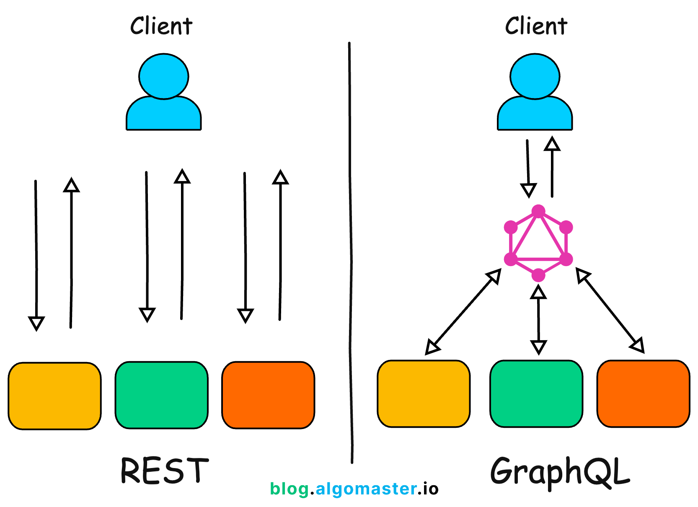
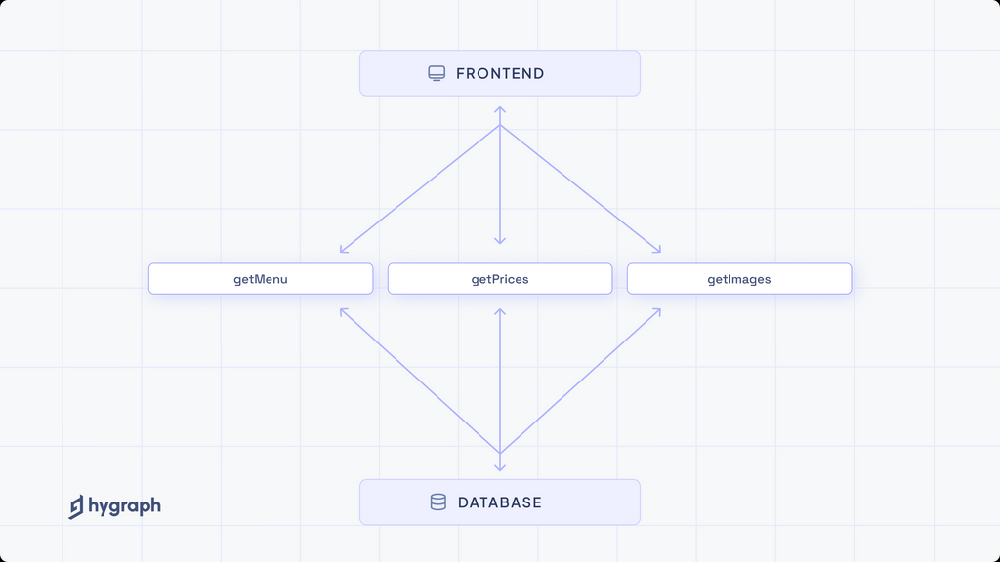
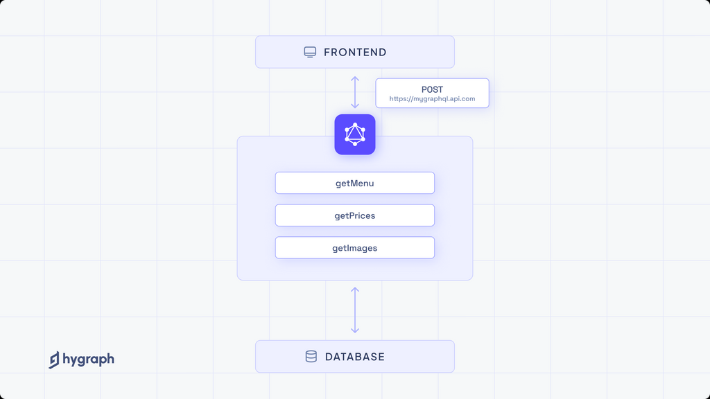
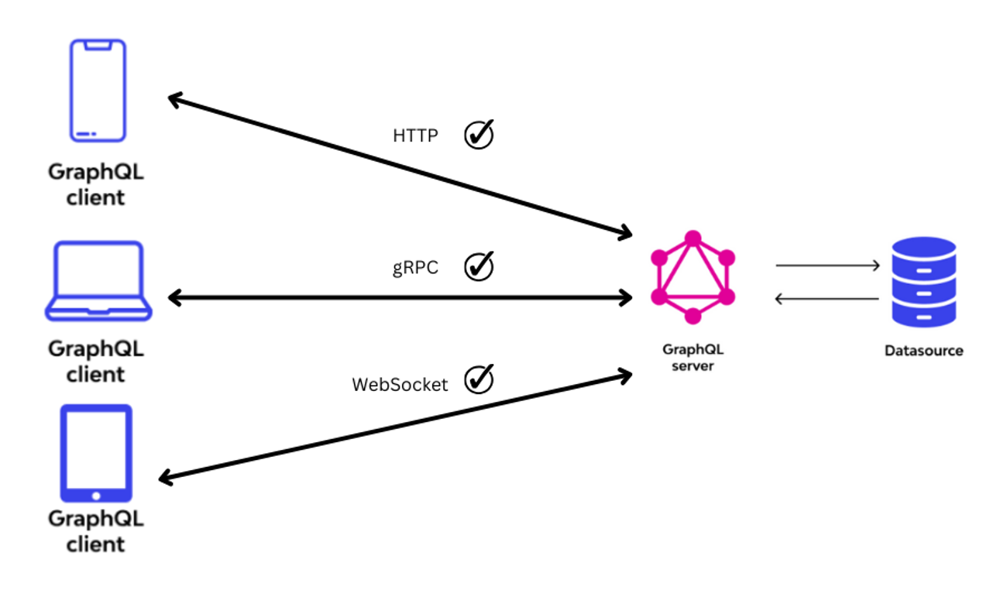
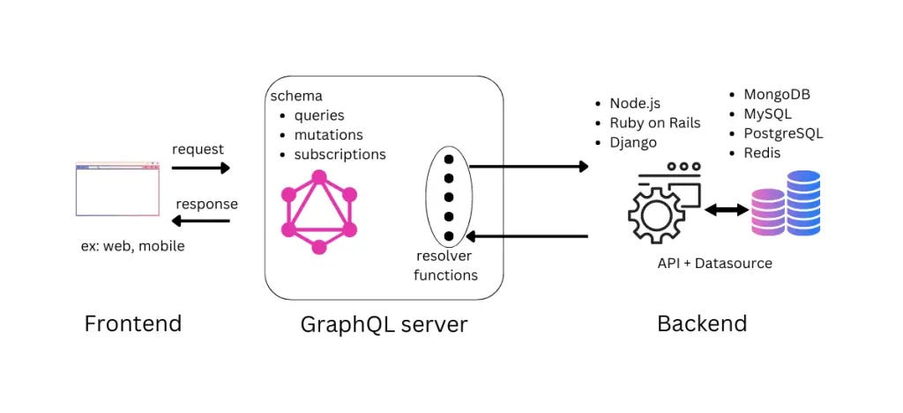
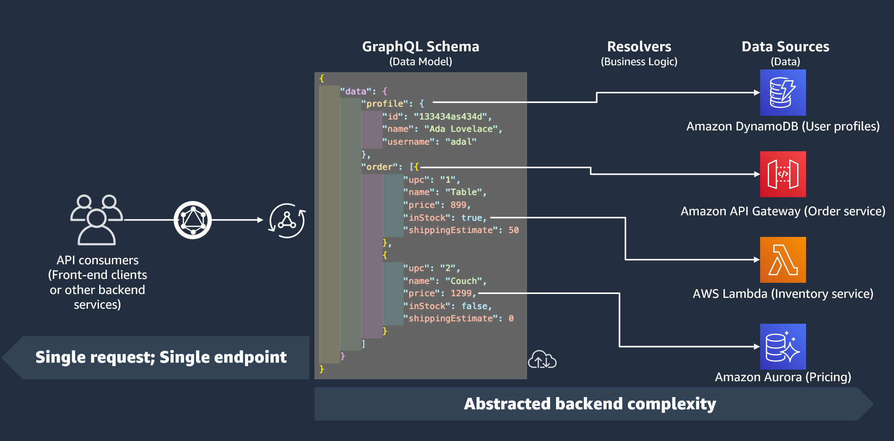
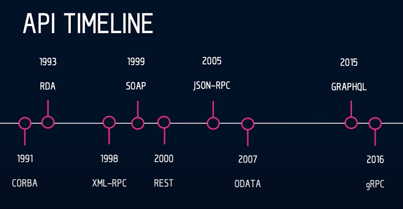
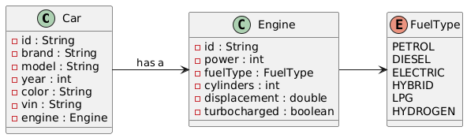

= GraphQL - A query language for your API
:sectnums:
:author: Linus Nestler
:toc: left
:source-highlighter: rouge
:icons: font

== Was ist GraphQL

[quote,graphql.org]
____
GraphQL is a *query language* for *APIs* and a *runtime* for fulfilling those queries with your existing data.
GraphQL provides a complete and understandable description of the data in your API, gives clients the power to ask for *exactly what they need and nothing more*, makes it easier to evolve APIs over time, and enables powerful developer tools."
____

* Query Language: Definiert, was abgefragt wird.
** Standardisiertes Mittel, um Informationen aus einem System, z. B. einer Datenbank oder einer API, zu holen.
* API: Die Schnittstelle, die diese Abfragen ermöglicht.
* Runtime: Führt die Abfragen aus und liefert die Ergebnisse.

=== Rest vs. GraphQL

GraphQL und REST verfolgen unterschiedliche Ansätze, wenn es um den Zugriff auf Daten geht.

Während bei REST jede Datenressource über einen eigenen *Endpunkt* angesprochen werden muss, erlaubt GraphQL dem Client, alle benötigten Informationen in *einer einzigen* Abfrage zu definieren und gebündelt abzurufen.

.https://www.wallarm.com/what/graphql-vs-rest-all-that-you-must-know

* REST API – Der Client kommuniziert mit mehreren separaten Endpunkten, um Informationen zu erhalten.
* GraphQL API – Der Client sendet eine einzige Abfrage, die alle gewünschten Daten beinhaltet.
Die GraphQL-Schicht übernimmt das Routing zu den jeweiligen Datenquellen im Hintergrund.

==== REST

Was ist REST?

REST steht für **RE**presentational **S**tate **T**ransfer und ist ein Architekturstil für Web-APIs.
Er basiert auf dem HTTP-Protokoll und nutzt dessen Methoden wie GET, POST, PUT und DELETE, um auf Daten zuzugreifen oder diese zu verändern.

In einer REST-API ist jede Ressource (z.B. Menü, Preis oder Image) durch eine eindeutige URL (Endpunkt) identifizierbar.
Die Kommunikation erfolgt über mehrere solcher Endpunkte, wobei jede Anfrage eine vordefinierte Antwortstruktur liefert.

*Beispiel*: Um Informationen über ein Menü und dessen Bilder zu erhalten, muss der Client zwei Requests senden:

* /menu/123
* /menu/123/image

Nachteile:

* Mehrere Requests für zusammenhängende Daten
* Feste Antwortformate
* Oft unnötige oder unvollständige Daten (Over-/Underfetching)

Typisch für REST:

* Feste Routen wie /users, /posts, /comments
* Eine Antwortstruktur pro Endpunkt
* Separate HTTP-Requests pro Datenobjekt

.https://hygraph.com/blog/graphql-vs-rest-apis

[source,httprequest]
----
// Request
GET https://myrestapi.com/users/1

// Response
{
    "_id": "1",
    "name": "John Doe",
    "username": "johndoe",
    "email": "johndoe@gmail.com",
    "currentJobTitle": "Software Engineer",
    "phone": "9876543210",
    "gender": "MALE",
    "country": "Germany",
    "display_picture": "8ba58af0-1212-4938-8b4a-t3m9c4371952",
    "phone_verified": true,
    "email_verified": true,
    "_created_at": "2024-05-06T13:11:41Z",
    "_updated_at": "2024-05-08T13:11:41Z",
    "_deleted": false
}
----

==== GraphQL

GraphQL ist eine alternative API-Technologie, der Client formuliert eine einzige Abfrage, in der genau angegeben wird, welche Felder und Objekte benötigt werden.
Diese Anfrage wird an einen zentralen Endpunkt geschickt.

Im Hintergrund sorgt GraphQL dafür, dass alle relevanten Datenquellen kontaktiert und die Ergebnisse in einer einzigen, strukturierten Antwort zusammengeführt werden.

Vorteile:

* Nur ein Request nötig
* Flexible, client-gesteuerte Antwortstruktur
* Keine überflüssigen Daten

Beispiel: Mit einer einzigen Abfrage können Benutzerinformationen und zugehörige Beiträge geladen werden – ganz ohne mehrere HTTP-Aufrufe.

Typisch für GraphQL:

* Ein einziger Endpunkt (z. B. /graphql)
* Der Client bestimmt Struktur und Umfang der Antwort
* Kombinierte Daten aus mehreren Ressourcen in einer einzigen Antwort

.https://hygraph.com/blog/graphql-vs-rest-apis

[source,httprequest]
----
// Request
POST https://mygraphqlapi.com/

// Request Body
query getAllUsers($userId: string){
  userByUserId(userId:$userId){
    name
    email
    currentJobTitle
  }
}

// Response
{
    "name": "John Doe",
    "email": "johndoe@gmail.com",
    "currentJobTitle": "Software Engineer",
}
----
==== GraphQL - Transport

In Beispiel darüber wird GraphQL über HTTP angesprochen.
Es ist jedoch nicht auf HTTP beschränkt.
Da GraphQL kein Transportprotokoll ist, sondern ein Abfragesystem, kann es auch über andere Protokolle wie WebSocket oder gRPC verwendet werden.

IMPORTANT: GraphQL definiert, `wie` man Daten abfragen oder manipulieren kann – `nicht`, wie diese Daten transportiert werden.

In der Praxis wird GraphQL meist über HTTP verwendet, zB.:

* POST /graphql – mit einer Query im Body
* GET /graphql?query={...} – seltener, für einfache Lese-Requests

Der Vorteil:

* Bekannte HTTP-Mechanismen
* Authentifizierung
* Bestehende Infrastruktur nutzen

Alternative Transportprotokolle: (möglich, aber seltener) GraphQL kann theoretisch auch über andere Protokolle laufen, z.B.:

* WebSockets – z. B. für Subscriptions (live updates)
* MQTT / AMQP – in IoT- oder Messaging-Systemen
* gRPC – in performanteren Umgebungen

== Welches Problem löst GraphQL?

Bei klassischen REST-APIs stößt man in der Praxis schnell auf folgende Herausforderungen:

[cols="1,4",options="header"]
|===
| Problem | Beschreibung

| Overfetching
| Der Client erhält mehr Daten als benötigt, z.B. alle User-Felder, obwohl nur Name und E-Mail angezeigt werden sollen.

| Underfetching
| Es werden mehrere Requests nötig, um zusammengehörige Daten zu laden, z.B. zuerst ein User, dann separat seine Posts.

| Viele Endpunkte
| Für komplexe UIs müssen Daten aus verschiedenen Endpunkten zusammengeführt werden – das macht das Frontend komplexer.

| Fehlende Flexibilität
a| * REST-Endpunkte sind serverdefiniert – das Frontend muss sich anpassen.
* Mit **GraphQL** definiert das Frontend, welche Daten es braucht – unabhängig von serverseitigen Endpunkten.

| Versionierung
| API-Änderungen führen oft zu neuen Versionen (z.B. `/v1`, `/v2`), was Wartung erschwert.

| Transparenz
a| * Bei REST muss man oft Dokus lesen oder Trial & Error machen.
* ➤ **GraphQL ist introspektiv**: Clients können das Schema abfragen und automatisch Dokumentation und Tooling generieren.

|===

== Wie funktioniert GraphQL?

Idee: Der Client bestimmt, *was* er braucht – und der Server liefert *genau das*.

=== Grundprinzipien

.https://dineshigdd.medium.com/how-to-set-up-a-graphql-server-a-beginners-guide-to-graphql-fe1e7bb83ffc

|===
| Request (oder operation) | Response
a|
[source,graphql]
----
{
  hero {
    name
    appearsIn
  }
}
----
a|
[source,json]
----
{
  "data": {
    "hero": {
      "name": "R2-D2",
      "appearsIn": [
        "NEWHOPE",
        "EMPIRE",
        "JEDI"
      ]
    },
    .....
  }
}
----
|===

Der GraphQL-Server dient als mittlere Schicht zwischen Client und dem eigentlichen Backend.
Er ist verantwortlich für die Verarbeitung der Anfragen und das Bereitstellen der Daten.

Die wichtigsten Komponenten im Überblick:

* *Schema*: Definiert alle verfügbaren Typen, Felder und Operationen (Queries, Mutations, Subscriptions) im System.
* *Query Language*: Der Client formuliert seine Datenanfragen mit der deklarativen GraphQL-Abfragesprache.
* *Resolver*: Serverseitige Funktionen, die einzelne Felder in einer Abfrage mit konkreten Daten füllen – z. B. aus einer Datenbank, einem Cache oder einer REST-API.
* *Response*: Die Antwort des Servers spiegelt genau die Struktur der Anfrage wider – keine überflüssigen Daten, keine Überraschungen.

=== Schemas & Types

Ein GraphQL-Schema definiert die gesamte API-Struktur.

* Welche Datenobjekte verfügbar sind (Object Types)
* Welche Felder diese besitzen (inkl. Typen und Argumenten)
* Welche Operationen erlaubt sind (Queries, Mutations, Subscriptions)

Beispiel für einen Typ in SDL (Schema Definition Language):

[source,graphql]
----
type User {
    name: String
    email: String
    posts: [Post]
}

type Post {
    title: String
    description: String
    user: User
}
----
GraphQL definiert verschiedene Typen, die wir zum Aufbau eines Schemas verwenden können:

- Scalar Type
- Object Type
- Input Types
- Enumeration Type
- Union and Interface Type
- Lists and Non-Null

[%collapsible]
====

[source,graphql]
----
# normal scalars are Int, Float, String, Boolean, ID (serialized as a String)
# Custom scalar, to use Date it has to be implemented in the GraphQL-Server
scalar Date

# Enum type
enum Role {
  ADMIN
  USER
  GUEST
}

# Interface type
interface MediaItem {
  id: ID!
  title: String!
}

# Object types
type Book implements MediaItem {
  id: ID!
  title: String!
  author: Author!
  published: Date
}

type Movie implements MediaItem {
  id: ID!
  title: String!
  director: String!
  released: Date
}

type Author {
  id: ID!
  name: String!
  books: [Book!]!
}

type User {
  id: ID!
  name: String!
  email: String!
  role: Role!
}

# Union type
union SearchResult = Book | Author | Movie

# Input types
input CreateBookInput {
  title: String!
  authorId: ID!
  published: Date
}

input CreateUserInput {
  name: String!
  email: String!
  role: Role = USER
}

# Query type
type Query {
  books: [Book!]!
  users: [User!]!
  authors: [Author!]!
  search(keyword: String!): [SearchResult!]!
  me: User
}

# Mutation type
type Mutation {
  createBook(input: CreateBookInput!): Book!
  createUser(input: CreateUserInput!): User!
  assignRole(userId: ID!, role: Role!): User!
}

# Subscription type
type Subscription {
  bookAdded: Book!
  userSignedUp: User!
}
----
====

.https://tailcall.run/blog/graphql-schema/
image::images/graphql-schema-example.[]

==== Query

* *Query* ist einer der drei speziellen Einstiegspunkte (Root-Typen) in einem GraphQL-Schema.
* Er wird verwendet, um *Daten vom Server zu lesen*.
* Jede Query startet beim `Query`-Typ, der als Ausgangspunkt für Abfragen dient.
* Clients definieren in der Abfrage exakt, welche Felder (und verschachtelten Felder) sie benötigen.
* Beispiel:
+
[source,graphql]
----
query {
  books {
    title
    author {
      name
    }
  }
}
----

==== Mutation

* *Mutation* ist ein weiterer Root-Typ im Schema und wird verwendet, um *Daten zu verändern*.
* Dazu gehören Operationen wie Erstellen, Aktualisieren oder Löschen von Objekten.
* Mutationen ähneln vom Aufbau her Queries, haben jedoch in der Regel *Nebeneffekte* (z. B. Datenbankeinträge).
* Mutationen im GraphQL-Schema beginnen beim `Mutation`-Typ.
* Beispiel:
+
[source,graphql]
----
mutation {
  createBook(input: { title: "Neu", authorId: "1" }) {
    id
    title
  }
}
----

==== Subscription

* *Subscription* ist der dritte Root-Typ und dient der *Echtzeitkommunikation*.
* Damit können Clients eine dauerhafte Verbindung zum Server (z. B. über WebSockets) aufbauen.
* Der Server sendet *Live-Updates* an alle verbundenen Clients, wenn bestimmte Ereignisse eintreten (z. B. ein neues Objekt wird erstellt).
* Abfragen starten beim `Subscription`-Typ.
* Beispiel:
+
[source,graphql]
----
subscription {
  bookAdded {
    id
    title
  }
}
----

=== Resolver

.https://docs.aws.amazon.com/appsync/latest/devguide/resolver-components.html

*Resolver* sind Funktionen im Server-Code, die bestimmen, *wie und woher die Daten in einer GraphQL-Abfrage tatsächlich geholt oder verändert werden*. Während das Schema definiert, *was* möglich ist, liefern Resolver die *Logik*, um das umzusetzen.

- Jeder Feldname im GraphQL-Schema benötigt eine zugehörige Resolver-Funktion, außer er kann automatisch auf ein gleichnamiges Feld im Datenobjekt gemappt werden.
- Resolver erhalten die Argumente aus der Query oder Mutation und haben Zugriff auf den Kontext (z. B. Authentifizierungsinformationen).
- Besonders bei Mutationen (z. B. `createBook`, `deleteBook`) implementieren Resolver die tatsächlichen Schreiboperationen (z. B. Datenbankzugriffe).
- Bei Abfragen (Queries) holen Resolver die angeforderten Daten aus Datenquellen wie Datenbanken, APIs oder internen Diensten.

Beispiel für einen Resolver in JavaScript (z. B. mit Apollo Server):

[source,graphql]
----
type Book {
  id: ID!
  title: String!
  author: Author!
}

type Author {
  id: ID!
  name: String!
}

type Query {
  books: [Book!]!
}

type Mutation {
  deleteBook(id: ID!): Book
}
----

[source,javascript]
----
const books = [
  { id: '1', title: 'GraphQL Basics', authorId: 'a1' },
  { id: '2', title: 'Advanced GraphQL', authorId: 'a2' },
];

const authors = [
  { id: 'a1', name: 'Alice' },
  { id: 'a2', name: 'Bob' },
];

const resolvers = {
  Query: {
    books: () => books,
  },
  Mutation: {
    deleteBook: (_, { id }) => {
      const index = books.findIndex(book => book.id === id);
      if (index === -1) return null;
      const [deleted] = books.splice(index, 1);
      return deleted;
    },
  },
  Book: {
    author: (book) => authors.find(author => author.id === book.authorId),
  },
};
----

==== Argumente der Resolver-Funktion

* `parent` (auch `root` genannt): Das Ergebnis des übergeordneten Feldes
* `args`: Die Argumente, die an das Feld übergeben wurden (z. B. `id`)
* `context`: Gemeinsame Daten wie z. B. Authentifizierungsstatus, Datenbankverbindung
* `info`: Informationen über die Ausführung der aktuellen Abfrage

*Beispiel für Verwendung:*
[source,graphql]
----
mutation {
  deleteBook(id: "1") {
    id
    title
  }
}
----

*Erwartete Antwort:*
[source,json]
----
{
  "data": {
    "deleteBook": {
      "id": "1",
      "title": "GraphQL Basics"
    }
  }
}
----

Mit Resolvern wird also die eigentliche Geschäftslogik angebunden – sie sind das Bindeglied zwischen dem deklarativen Schema und der realen Datenquelle (z. B. Datenbank, API).

=== Implementationen

GraphQL kann mit verschiedenen Programmiersprachen und Frameworks implementiert werden. Die konkrete Ausführung – also wie Abfragen verarbeitet, Resolver ausgeführt und Datenquellen angebunden werden – übernimmt jeweils eine Library oder ein Framework. Je nach Sprache unterscheiden sich Aufbau und Syntax, das Grundprinzip bleibt jedoch identisch.

==== Beliebte Implementationen (Auswahl)

- *Apollo Server* (JavaScript/Node.js)
* Weit verbreitet, besonders für Web- und Fullstack-Entwicklung.
* Unterstützt einfache Resolverstruktur, Middleware (z. B. Authentifizierung) und Subscriptions.
- *GraphQL Java*
* Robuste Low-Level-Implementierung für Java.
* Wird oft in Spring Boot-Projekten verwendet.
- *SmallRye GraphQL* (MicroProfile / Jakarta EE)
* Integration in das MicroProfile-Ökosystem (Quarkus, Payara, WildFly etc.).
* Nutzt Annotationen zur Definition von Schema und Resolvern.
- *HotChocolate* (.NET)
* Moderne und flexible GraphQL-Bibliothek für .NET Core.
- *graphql-go* (Go)
* Leichtgewichtige, native Implementierung für Go-Projekte.

==== Fokus: SmallRye GraphQL

SmallRye GraphQL ist eine Spezialisierung für Java-Anwendungen im MicroProfile-Umfeld. Es basiert auf `GraphQL Java` und erlaubt es, ein Schema per *Annotationen* direkt auf Java-Klassen zu definieren.

Beispiel für eine einfache Abfrage:

[source,java]
----
@GraphQLApi
public class BookService {

    // Resolver für: query { books { title author } }
    @Query
    public List<Book> books() {
        return bookRepository.findAll();
    }

    // Resolver für: mutation { addBook(title: "...", author: "...") { title } }
    @Mutation
    public Book addBook(String title, String author) {
        Book book = new Book(title, author);
        return bookRepository.save(book);
    }
}
----

Die zugehörige Java-Klasse:

[source,java]
----
public class Book {
    public String title;
    public String author;

    public Book(String title, String author) {
        this.title = title;
        this.author = author;
    }
}
----

Besonderheiten von SmallRye GraphQL:

- Annotationen wie `@Query`, `@Mutation`, `@Subscription` machen separate SDL-Dateien überflüssig.
- Integrierbar in Java-Frameworks wie *Quarkus*, *Payara*, *WildFly*.
- Automatische Schema-Generierung aus Java-Klassen.
- Integration in REST-APIs über CDI (Context and Dependency Injection) und JAX-RS möglich.
- GraphQL UI (Explorer) oft standardmäßig verfügbar unter `/graphql-ui`.

NOTE: Resolver-Funktionen in SmallRye GraphQL werden automatisch aus annotierten Methoden erzeugt.
Du brauchst keine separate Resolver-Map oder Schema-Dateien. Die Magie passiert durch Annotationen und Reflektion im Hintergrund.

In z.B. Apollo müssen die resolver selbst geschrieben werden. (siehe 3.3)

== Entwicklung von GraphQL

Über die Jahre sind viele API-Standards entstanden, die alle ihre Vor- und Nachteile haben.
GraphQL ist ein relativ neuer Standard, der `2012 von Facebook` entwickelt wurde und ``2015 als Open Source ``veröffentlicht wurde.

=== API-Timeline

.https://www.altexsoft.com/blog/soap-vs-rest-vs-graphql-vs-rpc/

=== Wieso entstand GraphQL?

GraphQL wurde 2012 bei Facebook entwickelt, um die Herausforderungen beim Datenabruf in mobilen Apps zu lösen. Insbesondere bei der Umstellung von Web-Wrappern hin zu nativen mobilen Anwendungen stieß Facebook an Grenzen mit bestehenden API-Ansätzen wie REST.

Facebook apps waren ursprünglich Web-Wrapper ("write once, run anywhere"), die auf mobile Geräte portiert wurden. Was bei der steigenden komplexität zu schlechter Performance und Nutzererfahrung führte.

==== Probleme mit klassischen APIs
* REST führte zu Overfetching/Underfetching und vielen Round-Trips.
* HTML-basierte Inhalte (z.B. der News Feed) waren schwer für mobile Apps nutzbar.
* Entwickler wollten APIs näher an der Modellstruktur der App.
* Komplexe Datenstrukturen erforderten aufwändige Server- und Client-Logik.

==== Die Lösung: GraphQL
GraphQL wurde als neue Datenabfragesprache entwickelt, die sich an den Bedürfnissen von Produktdesignern und Entwicklern orientiert. Die wichtigsten Eigenschaften:

* **Client-zentriert**: Die App bestimmt die Struktur der Daten durch eine Abfrage.
* **Hierarchisch**: Abfragen spiegeln die Objektbeziehungen wider – passend zur UI.
* **Unabhängig vom Speicher**: GraphQL ist ein Protokoll, kein Datenbanksystem.
* **Introspektiv**: Clients können das API-Schema selbst abfragen.
* **Versionsfrei**: Neue Felder können hinzugefügt werden, ohne alte Clients zu brechen.

==== Erfolge bei Facebook
* 2012: News Feed wurde mit GraphQL nativ auf iOS und Android umgesetzt.
* Heute: GraphQL verarbeitet Milliarden von Anfragen täglich für hunderte App-Versionen.
* Entwicklertools wie GraphQL und Frameworks wie Relay wurden darauf aufgebaut.
* Eine (Js)Referenz-Implementierung und die Spezifikation wurden open-sourced, um eine Community aufzubauen.

Spezifikation: https://spec.graphql.org/June2023/[GraphQL Specification]

== Wer benutzt GraphQL?

.https://graphql.org/

=== GitHub

===== Was GitHub mit GraphQL macht:
Seit 2016 bietet GitHub eine offizielle GraphQL API v4 an.

* Sie wurde entwickelt, um komplexe und flexible Datenabfragen zu ermöglichen.
* Viele interne Tools und neuere Features (z. B. GitHub Projects, Actions, Insights) nutzen intern GraphQL.
* Entwickler können mit einer einzigen Abfrage z. B. Repositories, Issues, Pull Requests und Commits abfragen – was mit REST mehrere Aufrufe bräuchte.

===== Aber: Die REST API (v3) bleibt bestehen.

* GitHub betreibt beide APIs parallel, um Abwärtskompatibilität zu wahren.
* Für einfache Anwendungsfälle oder Skripte ist REST oft schneller umzusetzen.

GitHub hat GraphQL eingeführt, um REST zu ergänzen, nicht zu ersetzen. Die GraphQL API ist die empfohlene Wahl für neue, komplexe Anwendungen, während REST weiterhin für einfache oder etablierte Workflows genutzt werden kann.

https://docs.github.com/de/graphql/overview/explorer[GitHub GraphQL Explorer]

.Example
[%collapsible, ]
====

.get all repositories with some details
[source,graphql]
----
query {
  viewer {
    repositories(first: 100, orderBy: {field: NAME, direction: ASC}) {
      nodes {
        name
        description
        url
        isPrivate
      }
    }
  }
}
----

.recent pull requests
[source,graphql]
----
query {
  viewer {
    pullRequests(first: 10, orderBy: {field: CREATED_AT, direction: DESC}) {
      nodes {
        title
        url
        createdAt
        state
        repository {
          nameWithOwner
        }
      }
    }
  }
}
----

.introspection (Selbstbeobachtung)
[source,graphql]
----
query {
  __schema {
    types {
      name
    }
  }
}
----

====

== Beispiel Projekt

In diesem Beispielprojekt wird eine einfache GraphQL-API für Autos und Motoren implementiert.

=== Datenmodell

=== Struktur

----
src/main/java/
└── at/
└── htl/
├── boundary/
│   └── CarGraphQLResource.java
├── controller/
│   ├── CarRepository.java
│   └── EngineRepository.java
└── entity/
    ├── Car.java
    └── Engine.java
----

== Fazit
